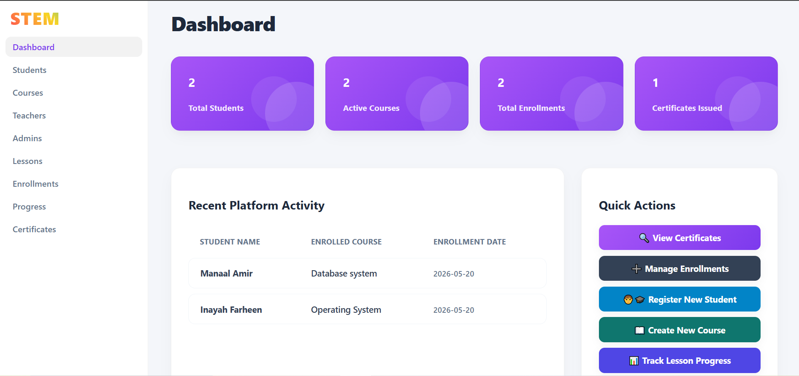
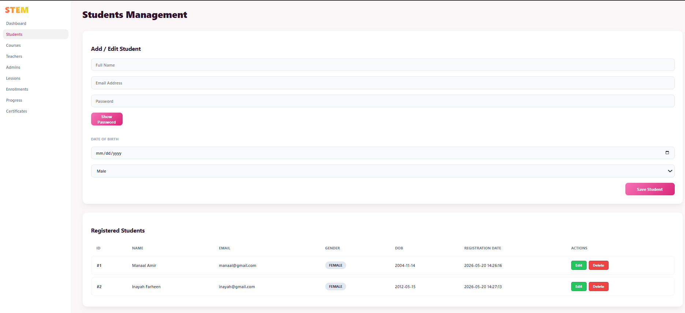
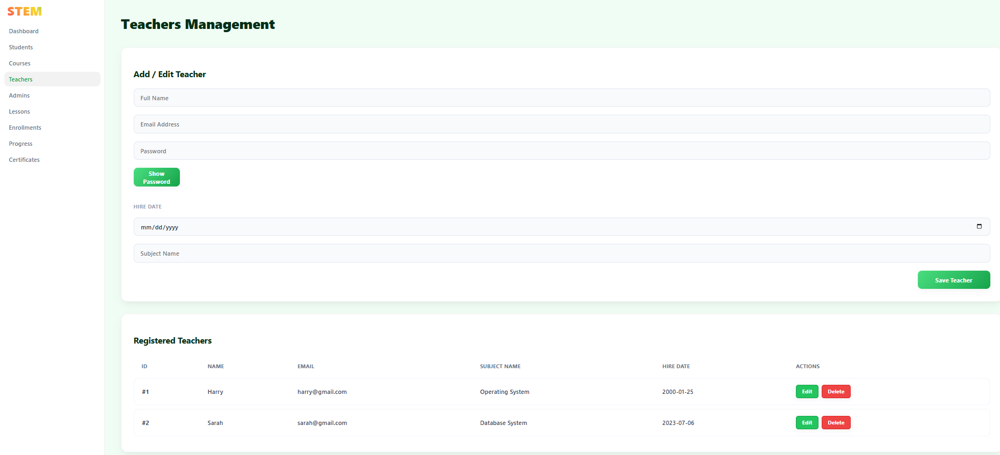
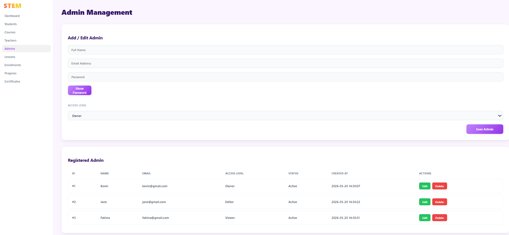
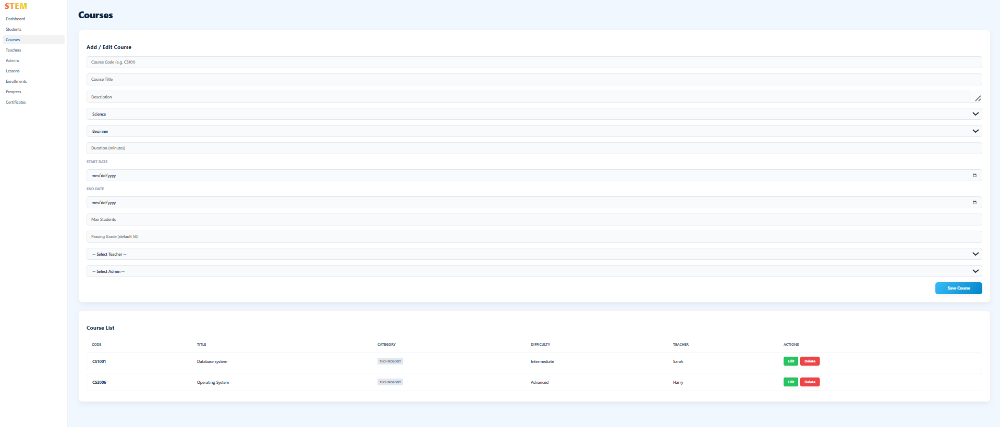
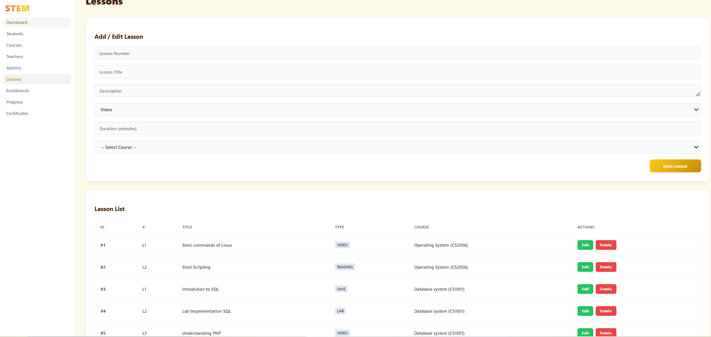
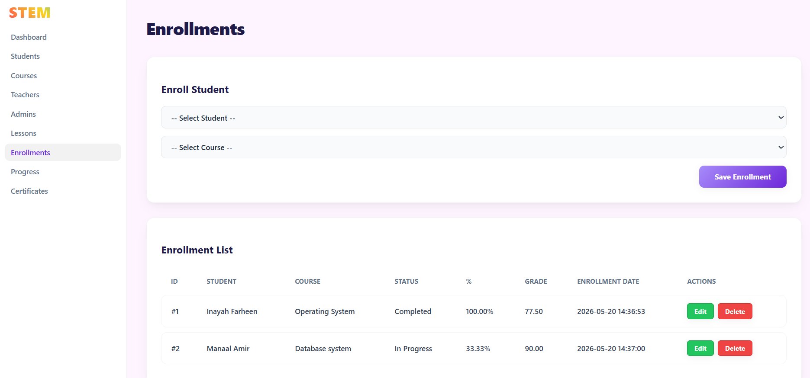
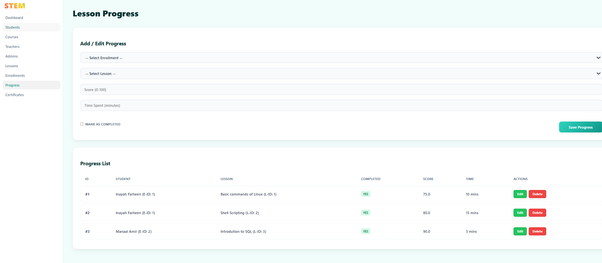
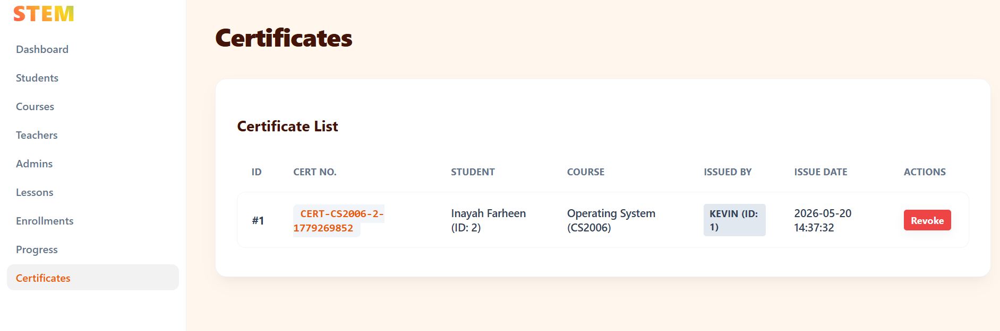

# STEM_Course_Platform

The STEM Course Platform is a database-driven system that stores and manages information about students, STEM courses, and lessons. It records student progress and course completion, and issues certificates upon completion. The system provides an organized platform for tracking learning activities and student achievements.

---

## Features

1. Student Management (CRUD)
2. Teacher Management (CRUD)
3. Admin Management (CRUD)
4. Course Management (CRUD)
5. Lesson Management (CRUD)
6. Enrollment Tracking
7. Lesson Progress Tracking
8. Certificate Issuing System
9. Dashboard Metrics
10. Responsive Modern UI
11. Relational Database Design
12. SQL Injection Prevention using Prepared Statements

---

## Technologies Used

### Frontend
1. HTML
2. JavaScript
3. CSS

### Backend
1. PHP
2. MySQL

---

## Project Modules

### Dashboard
Displays:
1. Total students
2. Total courses
3. Total teachers
4. Total enrollments
5. Total certificates
6. Recent enrollment activity

### Students
1. Add students
2. View students
3. Update student records
4. Delete students

### Teachers
1. Add teachers
2. View teachers
3. Update teacher records
4. Delete teacher records

### Admins
1. Add admins
2. View admins
3. Update admin records
4. Delete admin records

### Courses
Stores course details including:
1. Category
2. Difficulty
3. Duration
4. Passing grade
5. Teacher assignment

### Lessons
Each course contains lessons with:
1. Lesson numbers
2. Titles
3. Content type
4. Duration

### Enrollments
Tracks:
1. Student enrollments
2. Completion percentage
3. Final grades
4. Completion status

### Lesson Progress
Tracks:
1. Lesson completion
2. Scores
3. Time spent

### Certificates
Issues certificates only after 100% course completion.

---

## SQL Injection Protection

The application uses prepared statements with:

- `mysqli_prepare()`
- `mysqli_stmt_bind_param()`

This prevents SQL Injection attacks by separating SQL logic from user input.

Example:

```php
$stmt = mysqli_prepare($conn,
"INSERT INTO students (studentName, email, pwd)
VALUES (?, ?, ?)");

mysqli_stmt_bind_param($stmt, "sss",
$name, $email, $password);
```

---

## Database Design

The database contains relational tables including:

1. students
2. teachers
3. administrators
4. courses
5. lessons
6. enrollments
7. lessonProgress
8. certificates

Relationships are implemented using foreign keys.

---

## Screenshots

### Dashboard


### Students Page


### Teachers Page


### Admins Page


### Courses Page


### Lessons Page


### Enrollments Page


### Progress Tracking Page


### Certificates Page


---

## How to Run the Project

1. Install XAMPP
2. Start Apache and MySQL
3. Place project folder inside `htdocs/`
4. Import the SQL database into phpMyAdmin
5. Open in browser:

```text
http://localhost/project-folder-name
```

---

## Project Structure

```text
STEM_Course_Platform/
│
├── api.php
├── app.js
├── style.css
├── home.html
├── students.html
├── teacher.html
├── course.html
├── admin.html
├── lesson.html
├── enrollment.html
├── progress.html
├── certificate.html
│
├── DDL.sql
├── ERD.png
├── README.md
│
└── screenshots/
    ├── dashboard.png
    ├── students.png
    ├── teachers.png
    ├── admins.png
    ├── courses.png
    ├── lessons.png
    ├── enrollments.png
    ├── progress.png
    └── certificates.png
```

---

## Group Information

- Group Number: 12
- Name: Manaal Amir
- Roll No: 24P-0512
